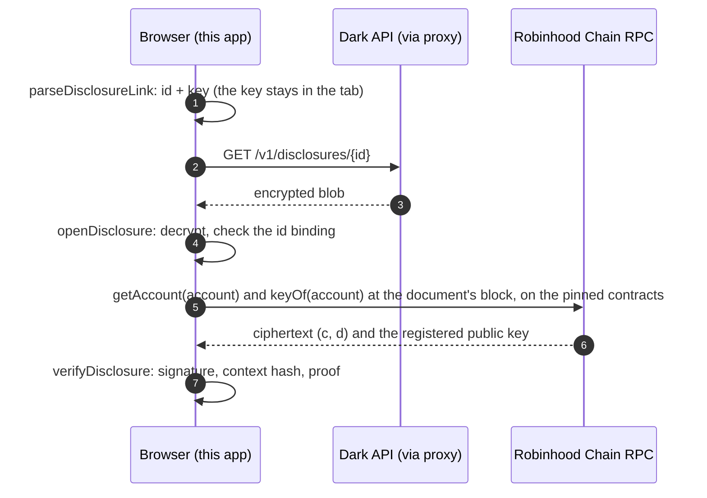

<div align="center">


# Dark Starter

**A minimal, read-only starter template for developers building on Dark: read the vault, verify disclosures, all in the browser.**

[](#license)
[](tsconfig.json)
[](package.json)
[](vite.config.ts)
[](.github/workflows/ci.yml)
[](#security)

[Website](https://darkwallet.cash) · [Whitepaper](https://darkwallet.cash/whitepaper) · [Docs](https://darkwallet.cash/docs) · [SDK](https://github.com/DarkWalletRH/dark-sdk) · [Contracts](https://github.com/DarkWalletRH/dark-contracts) · [Exit tool](https://github.com/DarkWalletRH/dark-exit)

</div>

---

## Overview

This repository is a **starting point for developers** who want to build on Dark, the confidential-balance
wallet for Robinhood Chain. It is a small Vite, React and TypeScript application that shows the two
integrations most third-party projects need first, written to be read, copied and replaced:

- reading Dark's **public on-chain state** with [viem], and
- **verifying a disclosure link** (a signed, zero-knowledge statement about a private balance) entirely
  in the browser, without trusting Dark's servers.

It is **not** the Dark website and **not** the Dark wallet. It has no design system, no marketing pages
and no deployment tooling. The application is **read-only**: it never asks for a key, never signs and
never sends a transaction.

> [!NOTE]
> Dark encrypts USDG balances and the amounts of transfers between Dark accounts. Deposits and
> withdrawals are public token transfers, and addresses are always visible. Dark is not a mixer and
> provides no anonymity set.

## Features

| Page | What it demonstrates |
|---|---|
| **Network** | Selects mainnet (`4663`) or testnet (`46630`) from the SDK's `deployments` record, lists every deployed contract with an explorer link, and reads the vault's total value locked, caps and pause flag live, all at one block. |
| **Verify a disclosure** | Parses a disclosure link, fetches the sealed document, decrypts it locally, reads the account's ciphertext and registered key from chain, and runs the SDK's `verifyDisclosure`. Exact-amount claims verify with elliptic-curve arithmetic alone; range claims load a pinned `bb.js` verifier on demand. |
| **Build your own** | Points to the SDK, the contracts and the exit tool, and maps the files in this template. |

## Quick start

**Prerequisites:** Node.js 22.12 or later, npm, and git (the SDK is installed from its repository).

```bash
git clone https://github.com/DarkWalletRH/Darkwallet.git
cd Darkwallet
npm install        # also builds the SDK from source (its prepare script)
npm run dev        # http://localhost:5173
```

| Command | Description |
|---|---|
| `npm run dev` | Development server with hot reload and the API proxy |
| `npm run build` | Production build to `dist/` (static files) |
| `npm run typecheck` | `tsc --noEmit` in strict mode |
| `npm run preview` | Serves `dist/` locally, with the same API proxy as `dev` |

During `npm run build`, Vite reports that a few `node:` modules were externalized. They belong to the
SDK's Node.js prover, which a browser bundle never calls; the warning is expected.

## Project structure

```
.
├── index.html
├── vite.config.ts          Dev/preview proxy to the Dark API
├── .env.example            Optional RPC overrides
└── src/
    ├── main.tsx            Entry point and a three-route hash router
    ├── styles.css          One neutral stylesheet
    ├── lib/
    │   ├── networks.ts     Chains, RPC endpoints, API paths, viem clients
    │   ├── verifyLink.ts   The complete disclosure verification flow, framework-free
    │   └── rangeProof.ts   Lazily loaded bb.js range-proof verifier and its pinned key
    └── pages/
        ├── Overview.tsx    Network overview
        ├── Verify.tsx      Disclosure verification UI
        └── Build.tsx       Pointers for building further
```

`src/lib/` holds everything Dark-specific and has no React dependency. `src/pages/` is presentation only
and is meant to be replaced.

## Dependencies

| Package | Version | Why |
|---|---|---|
| [`@darkwalletrh/dark-sdk`](https://github.com/DarkWalletRH/dark-sdk) | `v0.4.2` (git tag) | Deployments, ABIs, Grumpkin arithmetic and the `/disclosure` entry point |
| [`viem`][viem] | `^2` | JSON-RPC reads and EIP-712 signature recovery |
| [`@aztec/bb.js`](https://www.npmjs.com/package/@aztec/bb.js) | `5.0.0-nightly.20260522`, **exact** | Range-proof verification |
| `react`, `react-dom` | `^19` | User interface |

`@aztec/bb.js` must match the version in the SDK's `peerDependencies` **exactly**. Proofs and
verification keys are not portable across Barretenberg versions, and a mismatch does not raise an
error: valid proofs simply fail to verify. Upgrade it only together with the SDK.

## Configuration

All configuration is optional. Copy `.env.example` to `.env.local` to override a value.

| Variable | Default | Purpose |
|---|---|---|
| `VITE_MAINNET_RPC_URL` | `https://rpc.mainnet.chain.robinhood.com` | JSON-RPC endpoint for chain `4663` |
| `VITE_TESTNET_RPC_URL` | `https://rpc.testnet.chain.robinhood.com` | JSON-RPC endpoint for chain `46630` |

> [!IMPORTANT]
> `VITE_*` variables are compiled into the JavaScript bundle and are visible to every visitor. Never put
> a private key, a seed phrase, an API key or a keyed RPC URL in them.

**Historical state.** Verifying a disclosure reads the chain at the block the disclosure refers to. The
public endpoints keep only recent state, about 6,000 blocks (roughly 10 to 20 minutes), and answer
`historical state … is not available` for anything older. To verify older links, point the variables
above at an endpoint that serves historical state (an archive node). The network overview reads the
latest block and works with any endpoint.

## How disclosure verification works

A disclosure link has the form `https://darkwallet.cash/d/<id>#k=<key>`. The id names an encrypted
document held by the Dark API. The key travels in the URL fragment, which browsers never send to a
server, so the API stores a document it cannot read.



The only thing taken from the Dark API is the encrypted blob. The facts the proof is checked against
are read from the chain, at the contract addresses pinned in the SDK, never at addresses the document
names. `verifyDisclosure` then checks the document version and expiry, the pinned vault and registry,
the registered key, the on-chain ciphertext, the rebuilt context hash, the owner's EIP-712 signature,
and finally the proof: a Chaum-Pedersen (DLEQ) proof for exact amounts, or an UltraHonk proof of the
`dark_disclose_range` circuit for ranges.

### Results

| Result | Meaning |
|---|---|
| **Verified** | The proof holds against the ciphertext on chain. The account's balance had the claimed value, or lay in the claimed range, at that block. |
| **True, but proves nothing** | The claim matches the chain, but the account has only received deposits, so its balance is already public. Anyone could have read it from the chain, so the proof shows no knowledge of the account's private key. |
| **Not verified** | Some check failed. Nothing in the document has been confirmed, so none of its fields are displayed; the verifier's reason goes to the browser console, not the page. |
| **Expired** / **Unsupported document version** | Not checked. |
| **Not checked** | A claim about a payment (`transfer_exact`, `flow_total_*`). These must be recomputed from event logs, which this template does not do. |
| **No such disclosure** / **Revoked or expired** / **Does not decrypt** | The API has no such id, the link was revoked or reached its expiry, or the key does not open the document. |

### What a verdict does and does not prove

| Proves | Does not prove |
|---|---|
| One fact about one account's balance at one block | Anything about the balance before or after that block |
| That the account's owner signed the statement | Who sent you the link; links can be forwarded |
| That the ciphertext is the one recorded on chain | That the label is true; it is free text chosen by the sender |

### Range proofs

Range disclosures are verified with `@aztec/bb.js`, roughly 4 MB of WebAssembly that is downloaded
only when a range link is opened. `src/lib/rangeProof.ts` compiles in two things so that no verifier
input is fetched at runtime:

- **The verification key** for `dark_disclose_range`. Its SHA-256,
  `66b2d395d42daebfc4b2a4fa5da65b875736d2994cc4fef9a3476e27edccdb43`, is the `vk_sha256` recorded in
  [`circuits/manifest.json`](https://github.com/DarkWalletRH/dark-contracts/blob/main/circuits/manifest.json)
  of the contracts repository, and the bytes are re-hashed against it before every use.
- **The 256-byte slice of the BN254 reference string** a verifier needs. Without it, bb.js downloads
  about 16 MiB from a third-party CDN, which would reveal to that CDN who opened a disclosure, and when.

## Deploying

`npm run build` produces a static site in `dist/` that any static host can serve.

The Dark API accepts browser requests only from Dark's own origins, so this app never calls it
directly. It requests a same-origin path, and something in front of it must forward that path:

| Path served by your host | Forwards to |
|---|---|
| `/dark-api/v1/disclosures/<id>` | `https://api.darkwallet.cash/v1/disclosures/<id>` |
| `/dark-api-testnet/v1/disclosures/<id>` | `https://api-testnet.darkwallet.cash/v1/disclosures/<id>` |

`npm run dev` and `npm run preview` do this for you (`vite.config.ts`). **A production deployment needs
its own proxy.** An nginx example:

```nginx
location /dark-api/v1/disclosures/ {
    limit_except GET { deny all; }
    proxy_pass https://api.darkwallet.cash/v1/disclosures/;
    proxy_ssl_server_name on;
    add_header Cache-Control "no-store" always;
}
location /dark-api-testnet/v1/disclosures/ {
    limit_except GET { deny all; }
    proxy_pass https://api-testnet.darkwallet.cash/v1/disclosures/;
    proxy_ssl_server_name on;
    add_header Cache-Control "no-store" always;
}
```

Forward only `GET /v1/disclosures/<id>`, which is the one route this app uses, so the proxy cannot be
used to reach anything else. Responses must not be cached. The chain RPC is called directly from the
browser and needs no proxy.

## Security

- **Read-only by construction.** No code path in this template accepts a key, signs a message or sends
  a transaction.
- **The link key never leaves the tab.** Only the disclosure id is sent to the API.
- **The chain is the source of truth.** Contract addresses come from the SDK's `deployments`; the
  ciphertext and registered key are read from the RPC endpoint you configure. That endpoint is the one
  remaining party this app trusts. Run your own node if that matters to you.
- **Fail closed.** Every exception from the network or the range verifier is reported as "could not be
  checked", never as a verdict. Unverified documents are never rendered.
- **No third parties.** The app loads no external scripts, fonts or analytics. Its only outbound
  requests go to the chain RPC and to your own origin.
- **Whoever serves the page decides what code runs.** A verifier is only as trustworthy as the host that
  delivers it. Build and host it yourself when the verdict matters.

Please report vulnerabilities in Dark privately to **team@darkwallet.cash**. Do not open a public issue.
See [darkwallet.cash/.well-known/security.txt](https://darkwallet.cash/.well-known/security.txt).

## Status

Version 1.0.1, built against `@darkwalletrh/dark-sdk` v0.4.2. Dark's contracts and SDK are
**pre-audit** and run under on-chain caps during the beta. Do not rely on them to secure funds you cannot
afford to lose.

## License

Licensed under either of

- Apache License, Version 2.0 ([LICENSE-APACHE](LICENSE-APACHE))
- MIT license ([LICENSE-MIT](LICENSE-MIT))

at your option. Unless you explicitly state otherwise, any contribution intentionally submitted for
inclusion in this work shall be dual-licensed as above, without any additional terms or conditions.

[viem]: https://viem.sh
